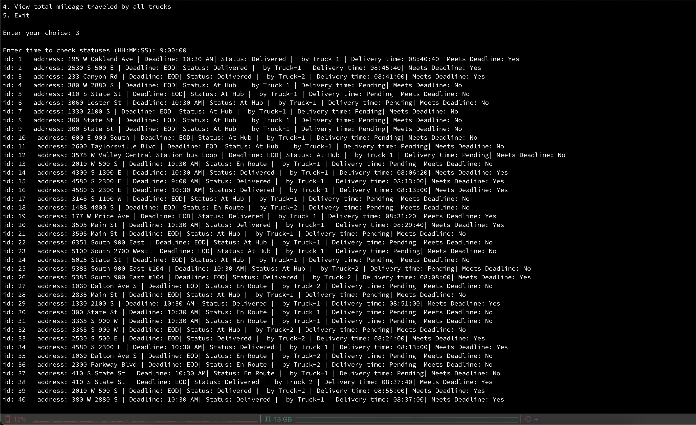
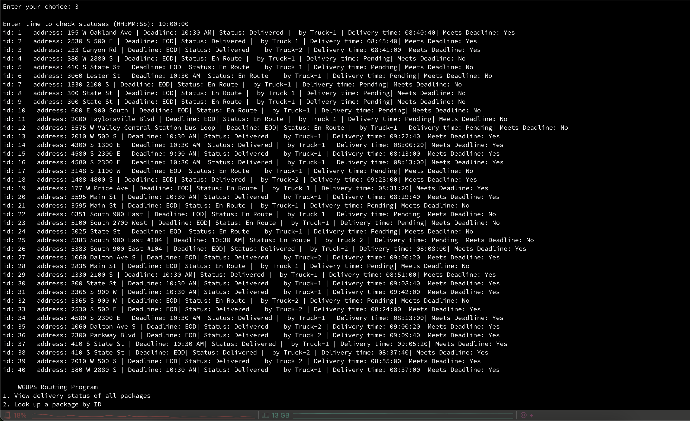
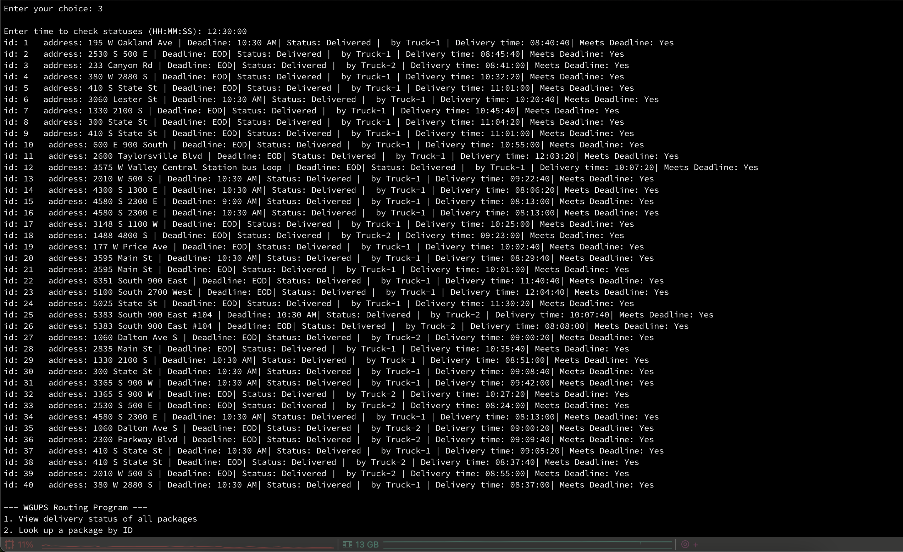
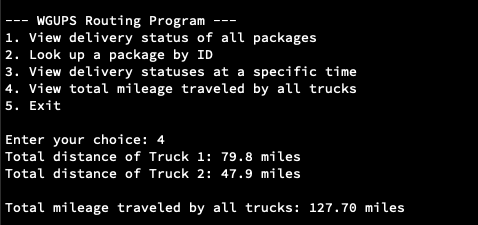

# WGUPS
## By Tristan Setha
### A.  Identify a named self-adjusting algorithm (e.g., nearest neighbor algorithm, greedy algorithm) that could be used to create your program to deliver the packages.

The Nearest Neighbor Algorithm will be used, which selects the nearest unvisited delivery location at each location to minimize  the distance based on the truck's current location.

### B.  Identify a self-adjusting data structure, such as a hash table, that could be used with the algorithm identified in part A to store the package data.

A hash table can be used to store package data efficiently. Hash tables dynamically adjust their size as more elements are added, and each package is keyed by its unique package ID, enabling O(1) average lookup time.

1. In a hash table, each key is associated with a value. In this case, the package ID will map to an index where the package data is stored. Using a hash function provides direct access to update package information. Related components, such as deadlines and addresses, are grouped within each package entry in the hash table. The hash table allows dynamic updates to package data, enabling tracking of package status and live updates for delivery information.


### C.  Write an overview of your program in which you do the following:


Explain the algorithm’s logic using pseudocode.
	Sort packages by deadline
```
INPUT: 
Adjacency matrix of distances (distance_matrix), 
HashMap of packages (packages), Truck capacity (max_capacity)

OUTPUT:
Packages with info, delivery time and a boolean displaying if delivered on time


INITIALIZE undelivered_packages = all packages
FOR each undelivered_packages:
    ASSIGN up to 16 packages to Truck1
    ASSIGN up to 16 packages to Truck2

SET current_time = 8:00 AM

WHILE undelivered_packages exist:
    FOR each truck:
        IF truck has packages:
            FIND nearest neighbor for the next package
            DELIVER the package
            UPDATE package status to "delivered"
            RECORD delivery time for the package
            UPDATE truck location
            UPDATE current_time
        IF current_time == 10:20 AM:
            UPDATE package #9 with the new address

RETURN all package data
PRINT all package information
```
### 2.  Describe the programming environment you will use to create the Python application, including both the software and hardware you will use.
Software: Visual studio code, iTerm, Python 3.12.4, MacOS Sequoia 15.1
Hardware: Macbook Air, Apple M1 Chip, 16gb memory, Dell monitor

### 3.  Evaluate the space-time complexity of each major segment of the program and the entire program using big-O notation.

Hashtable operation O(1)
Nearest Neighbor Algorithm O(n)
Algorithm: Search all packages with each package o(n^2)


### 4.  Explain the capability of your solution to scale and adapt to a growing number of packages.

The solution can scale to handle more packages by implementing route optimization techniques, such as pre-computing routes using hash maps to group packages by delivery addresses. This method allows efficient management of large datasets and reduces redundant calculations.


### 6.  Describe both the strengths and weaknesses of the self-adjusting data structure (e.g., the hash table).

Strengths: Hash tables provide O(1) average time complexity for lookups and updates, are dynamic for changes like status updates, and handle large datasets efficiently with proper hashing.
Weaknesses: Hash collisions may require additional logic to resolve conflicts.

### 7.  Justify the choice of a key for efficient delivery management from the following components:
	
“For all items that might be stored in the hash table, every key is ideally unique so that the hash table's algorithms can efficiently search for a specific item by that key” (Lysecky, Vahid, & Olds, n.d.). In this situation, the package ID is the most suitable key as it is unique, immutable, and clearly identifies each package. In contrast, fields like delivery address or deadline are not unique and could lead to ambiguity.

# Task 2


### 1.  Provide screenshots to show the status of all packages loaded onto each truck at a time between 8:35 a.m. and 9:25 a.m.



### ### 2.  Provide screenshots to show the status of all packages loaded onto each truck at a time between 9:35 a.m. and 10:25 a.m.



### 3.  Provide screenshots to show the status of all packages loaded onto each truck at a time between 12:03 p.m. and 1:12 p.m.




### E.  Provide screenshots showing successful completion of the code that includes the total mileage traveled by all trucks.




### F.  Justify the package delivery algorithm used in the solution as written in the original program by doing the following:
### 1.  Describe two or more strengths of the algorithm used in the solution.

- Simplicity: The nearest neighbor algorithm used is simple and works well given our smaller dataset. Nearest neighbor's greedy approach minimizes total distance traveled and meets the scenario's requirements, making it a simple and practical choice for this solution.

- Adaptability: The nearest neighbor algorithm is adapted to be used to handle edge cases such as delayed arrivals, specific truck assignments, and grouped deliveries. These cases are handled in our package distribution algorithm and also handled dynamically during the delivery process. 

### 2.  Verify that the algorithm used in the solution meets all requirements in the scenario.


Edge cases are handled during package distribution among the trucks. Grouped packages are grouped and assigned to the same truck. Delayed arrival packages are managed by placing them on later trips. Nearest neighbor ensures that travel distance is minimized using a greedy approach. Each truck is routed with multiple trips with packages meeting all deadlines by end of day


### 3.  Identify two other named algorithms that are different from the algorithm implemented in the solution and would meet all requirements in the scenario.


Two algorithms: Christofides, Genetic


### a.  Describe how both algorithms identified in part F3 are different from the algorithm used in the solution.


1. Christofides' algorithm is designed for solving TSP problems with weighted graphs and works specifically with symmetric distances, which matches our problem. Its implementation is more complex than Nearest Neighbor, as it relies on minimum spanning trees, matching algorithms, and Eulerian circuits.

2. Genetic algorithms, inspired by natural evolution, optimize solutions by iteratively modifying a population of potential routes (MathWorks, 2019). They are well-suited for the TSP, where finding a global optimum is computationally expensive. However, they are more complex to implement, computationally heavier, and less predictable than our chosen algorithm.


### G.  Describe what you would do differently, other than the two algorithms identified in part F3, if you did this project again, including details of the modifications that would be made.


If I were to redo this project, I would dedicate more time upfront to carefully planning the class structure and how to handle edge cases. This would have reduced the need for redesigns later.


### H.  Verify that the data structure used in the solution meets all requirements in the scenario.
### 1.  Identify two other data structures that could meet the same requirements in the scenario.


Two data structures: Adjacency List, and Binary Heap 


### a.  Describe how each data structure identified in H1 is different from the data structure used in the solution.


Adjacency List: A list that stores connections between nodes as a list of neighbors. This can reduce memory usage compared to adjacency matrices. Adjacency lists are more space-efficient for sparse graphs but have slower lookups when compared to adjacency matrices.


Binary Heap: A binary tree that can be a Min Heap or Max Heap. In a Min Heap, the key at the root is the smallest among all keys in the heap (Binary Heap - GeeksforGeeks, 2014). A binary heap could prioritize packages or routes based on delivery deadlines. It allows efficient retrieval of the nearest package by deadline or distance, making it great for dynamic prioritization.


### I.  Acknowledge sources, using in-text citations and references, for content that is quoted, paraphrased, or summarized.


MathWorks. (2019). What Is the Genetic Algorithm? Mathworks.com. https://www.mathworks.com/help/gads/what-is-the-genetic-algorithm.html


Binary Heap - GeeksforGeeks. (2014, November). GeeksforGeeks. https://www.geeksforgeeks.org/binary-heap/


‌

